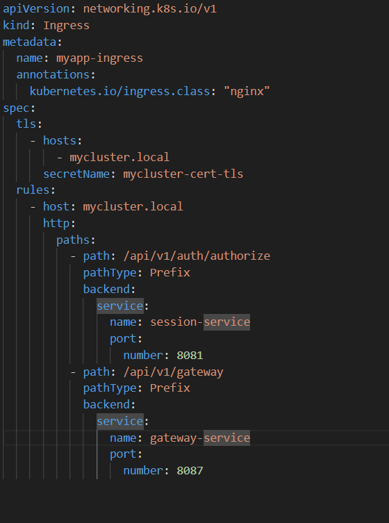

# Part 1  Развертывание собственного кластера k3s

1. Получаем набор виртуальных машин для кластера через Vagrant

2. Установливаем k3s на всех трех машинах. При установке не используем стандартный Ingress Controller при помощи флага --disable=traefik. Выполняем подключение узлов к кластеру, используя команду k3s server и флаги --token и --server для рабочих узлов и мастера соответственно Для автоматизации процесса пишем Bash скрипт для автоматического создания кластера при создании виртуальных машин

3. Устанaвливаем Ingress Controller Nginx вместо стандартного через `kubectl apply -f https://raw.githubusercontent.com/kubernetes/ingress-nginx/controller-v1.13.2/deploy/static/provider/cloud/deploy.yaml`

Проверяем что Nginx установился через `kubectl get pods -n ingress-nginx`

4. Получаем доменное имя mycluster.local добавляя его в /etc/hosts

- Устанавливаем cert-manager через `kubectl apply -f https://github.com/cert-manager/cert-manager/releases/download/v1.18.2/cert-manager.yaml`

- Проверяем что cert-manager установился

- Созадем объект типа cluster-issuer с типом self signed для генерации самоподписанного сертификата внутри кластера для корневого сертификата (CA)

- Создаем объект Certificate для создания TLS сертификаты, подписанные нашим CA, указывая на какие домены будут дейстовавать наш TLS-сертификат

- Получает корневой сертификат через sudo kubectl get secret my-ca-secret -n cert-manager -o jsonpath='{.data.ca\.crt}' | base64 --decode 

- Добавляем наш CA в список дополнительных доверенных корневых сертификатов

- Так же добавляем CA в список доверенных через certmgr на внешней машины Windows

5. Создаeм ресурс Ingress для своего личного домена и настроаиваем его для использования контроллера nginx ingress и полученного сертификата

6. Создаем PV (Persistent Volume) для базы данных PostgreSQL
- Создаем Persistent Volume для нашей БД из прошлого проекта. Для этого для начала создаем Persistent Volume Claim (PVC)

- Добавляем нашу привязку к PV через PVC в манифесте проекта

7. Запускаем приложение, описанное в манифесте через `sudo kubectl apply -f .`

Проверяем что поды запустились `sudo kubectl get pods`

8. Проводим тесты POSTMAN чтобы удостовериться в работоспособности приложения

9. Устанавливаем prometheus operator через helm

 
 Смотрим поды Prometheus Operator через `kubectl get nodes -n monitoring`

