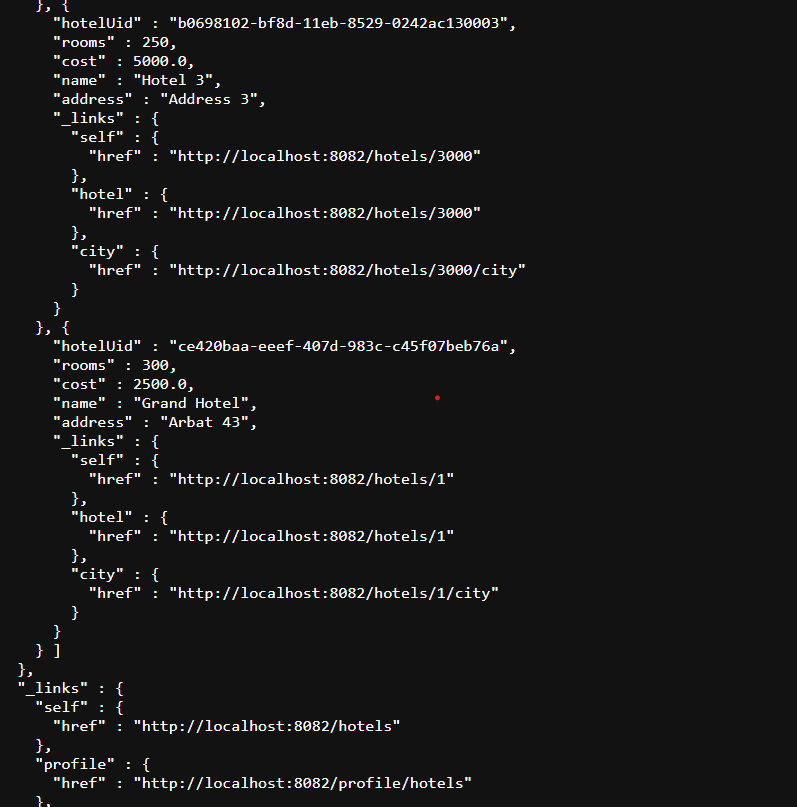

# Part 1. Удаленное конфигурирование узла через Ansible

1.Создаем три ВМ manager01 и node01б node02 с помощью vagrant

2. Поднимаем машины с помощью vagrant up

- Пытаемся подключиться к node01 с manager

- Генерируем ssh ключ через ssh-keygen и добавляем его вручную на node01

- Успешно подключаемся с manager на node01 через ssh

- Копируем docker-compose.yml и код сервисов на manager

- скачиваем ansible на manager01 

- Пишем inventory файл с адресом node02 и пингуем через ansible

3. Пишем первый плейбук для Ansible, который выполняет: apt update, устанавливает docker, docker-compose, копирует compose-файл из manager'а и разворачивает микросервисное приложение

4. Прогоняем тесты через Postman

5. Формируем три роли

- роль application выполняет развертывание микросервисного приложения при помощи docker-compose;

- apache устанавливает и запускает стандартный apache сервер;

- postgres устанавливает и запускает postgres, создает базу данных с произвольной таблицей и добавляет в нее три произвольные записи.

- Назначитаем первую роль node01 и вторые две роли node02

- Проверяем postman-тестами работоспособность микросервисного приложения

- Проверяем доступность web страницы apache

- Подключаемся к postgres и отображаем содержимое ранее созданной таблицы

# Part 2. Service discovery

1. Пишем два конфигурационных файла для consul сервера и consul клиента 

2. C помощью Vagrant создаем четыре машины  consul_server, api, manager и db.

3.  Пишем playbook и четыре роли

- описываем роль для install consul server

- описываем роль для install consul client

- описываем роль для install database

- описываем роль для install hotels service

Добавляем hotels service в systemd и передаем переменные окружение

Проверяем функционал через CRUD операции

получаем список отелей GET

Добавляем отель через POST

Проверяем что отель добавился

