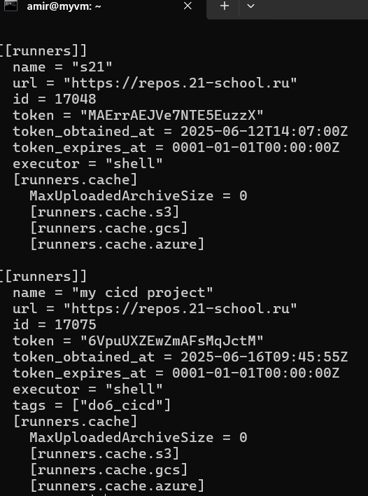
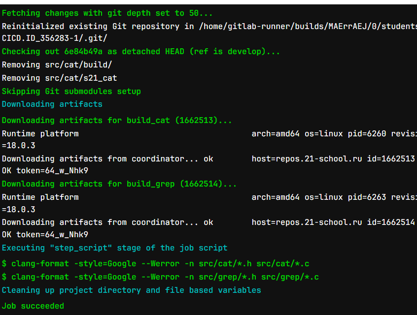
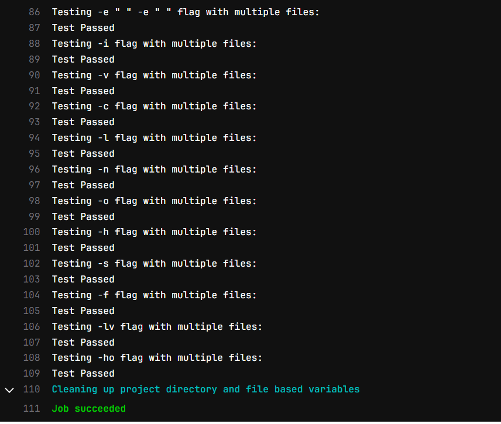
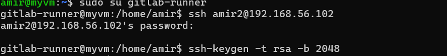
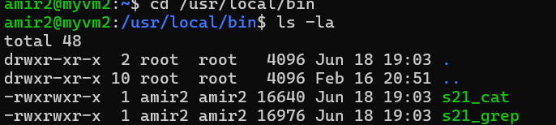

# Part 1. Настройка gitlab-runner
    Поднимаем виртуальную машину и устанавливаем gitlab-runner, регестрируем наш gitlab-runner для выполнения проекта.

# Part 2. Сборка

Пишем этап для CI по сборке приложений из проекта SimpleBashUtils.

В файле .gitlab-ci.yml добавляем этап запуска сборки через мейк файл из проекта SimpleBashUtils.

Файлы, полученные после сборки (артефакты), сохраняем в произвольную директорию со сроком хранения 30 дней.
 ( смотри .gitlab-ci.yml)

 # Part 2. Тест кодстайла

 Пишем этап для CI, который запускает скрипт кодстайла (clang-format).

 Вывод результата пайплайна

 
 
 # Part 4. Пишем интеграционные тесты

 Пишем этап для CI, который запустит интеграционные тесты.

 Результат:

 

 # Part 5. Этап деплоя

 Поднимаем вторую виртуальную машину Ubuntu Server 22.04 LTS.
 
 Пишем bash-скрипт, который при помощи ssh и scp копирует файлы, полученные после сборки (артефакты), в директорию /usr/local/bin второй виртуальной машины.

 Подключаем обе машины к одной сети через 
 sudo ip addr add 192.168.56.101/24 dev enp0s8  # в первой ВМ
sudo ip addr add 192.168.56.102/24 dev enp0s8  # во второй ВМ
sudo ip link set enp0s8 up

Передаем SSH ключ от гитлаб раннера второй машине чтобы не требовался пароль при выполнении действия

Проверяем что скрипт успешно перенес артефакты

