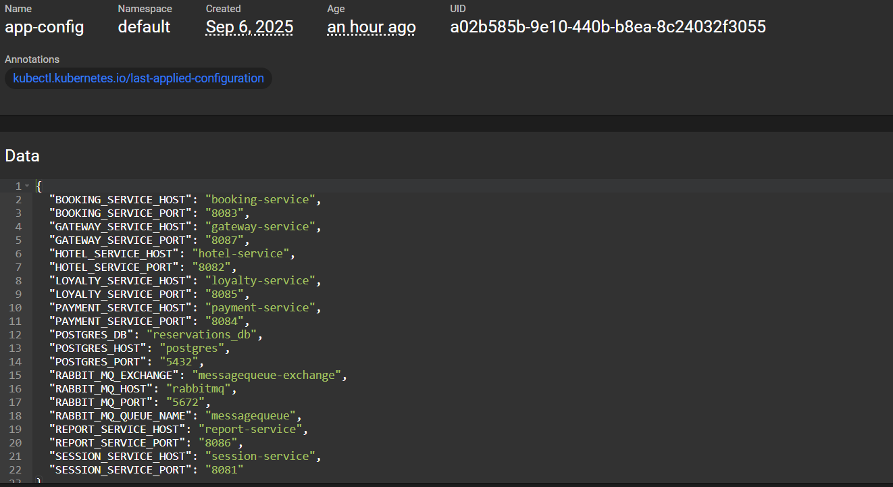

# Part 1. Использование готового манифеста

## 1. Запускаем окружение Kubernetes с памятью 4 GB.

`minikube start --memory=4096 --cpus=2 --driver-docker`

## 2. Применяем манифест из директории /src/example к созданному окружению Kubernetes.

## 3. Запускаем стандартную панель управления Kubernetes с помощью команды `minikube dashboard`.

## 4. Прокидываем туннели для доступа к развернутым сервисам с помощью команды `minikube service -all`

## 5. Открываем в браузере сервис apache

# Part 2. Написание собственного манифеста

## 1. Пишем yml-файлы манифестов для приложений из src/service

- карту конфигурации со значениями хостов БД и сервисов

- секреты с паролем и логином к БД и ключами межсервисной авторизации

- поды и сервисы для всех модулей приложения (см. src/manifests/deploy-service.yml)

## 2. Запускаем приложение через `kubectl apply -f .`

## 3. Проверяем статус созданных объектов (секреты, конфигурационная карта, поды и сервисы) в кластере с помощью команд `kubectl get <тип_объекта> <имя_объекта>`

Статус секретов 

Статус конфигурационной карты

Статус пода на примере booking service

Статус сервиса на примере booking service

## 4. Проверяем наличие правильного значения секрета через декодирование командой `kubectl get secret app-secrets -o jsonpath='{.data.POSTGRES_PASSWORD}' | base64 --decode`

## 5. Проверяем логи приложения через `kubectl logs` на примере booking-service

## 6.  Прокидываем туннели для доступа к gateway service и session service. через `kubectl port-forward`

## 7. Проводим тесты postman

## 8. Запускаем стандартную панель управления Kubernetes с помощью команды `minikube dashboard`.

- состояние узлов кластера, загрузка ЦП и память

- список запущененых PODS

- логи POD на примере loyalty-service

- данные configmap 

- данные секретов

## 9. Обновляем приложение (добавляя новую зависимость в pom-файл) и пересобираем его со следующими стратегиями развертывания 
    1. пересоздание (recreate) - сначала удаляются все старые поды, потом создаются новые с обновлённой версией.
    2. последовательное обновление (rolling) - старые поды заменяются новыми постепенно, по одному или партиями.

Добавляем зависимость в pom.xml 

Пушим наши образы на docker hub уже с новой версией 1.1

Меняем версию сервисов в yml файле на 1.1

Совершаем переразвертвание через Rolling update

 засекаем время перед началом развертывания

 после развертывания

`1757179160 - 1757179012 = 148 секунд`

Добавляем recreate cтратегию развертывания в yml файл ( Rolling Update является стратегию по умолчанию )

 засекаем время перед началом развертывания

  после развертывания

`1757183462  - 1757183433  = 29 секунд`