# Part 1. Запуск нескольких контейнеров Docker с помощью Docker Compose

Пишем докерфайлы для каждого сервиса

Размер одного образа

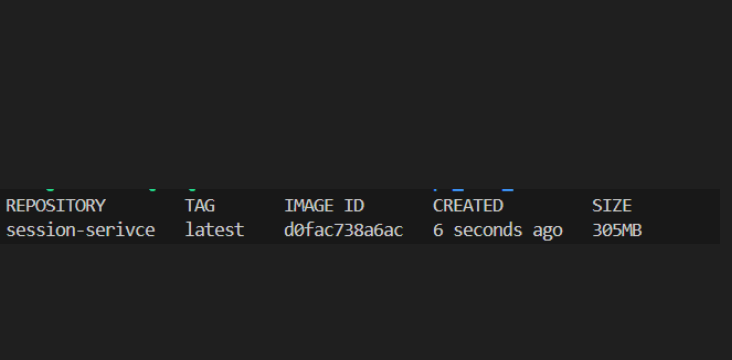

Пишем docker compose и  пробросываем порты для доступа к службе шлюза и службе сеансов на локальной машине.

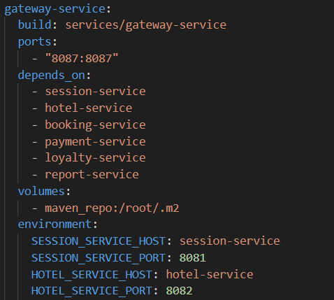

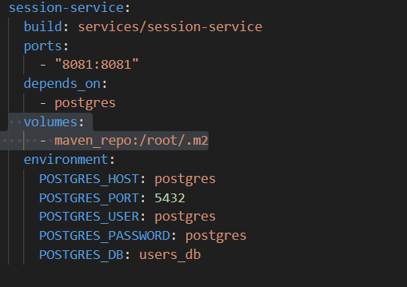

Собираем и разворачиваем веб-сервис через compose up, а затем проводим тесты через postman

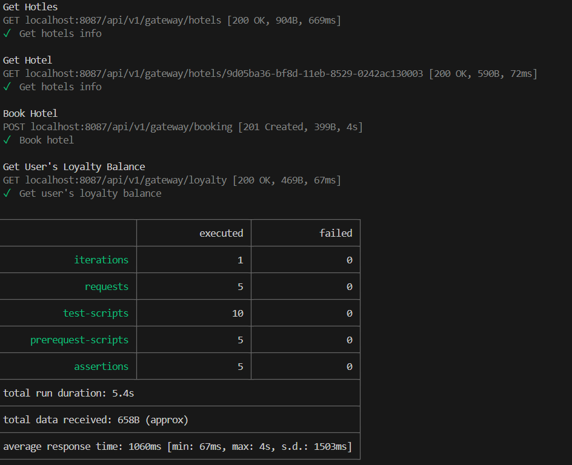

# Part 2. Созадние виртуальных машин

Пишем Vagrantfile для одной виртуальной машины, перенося туда весь исходный код сервиса.

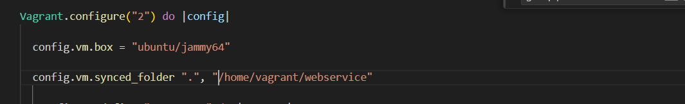

Заходим через консоль внутрь машины и проверяем что исходный код был перемещен

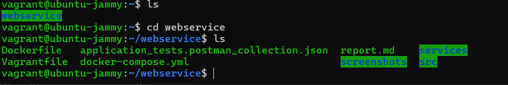

# Part 3. Создание простейшего docker swarm

Модифицируем Vagrantfile для создания трех машин: manager01, worker01, worker02.
Также пишем bash-scripts для инициализации кластера Docker swarm (см. scripts)

Загружаем наши образы на докер хаб и меняем docker-compose.yml для подгрузки образов из репозитория

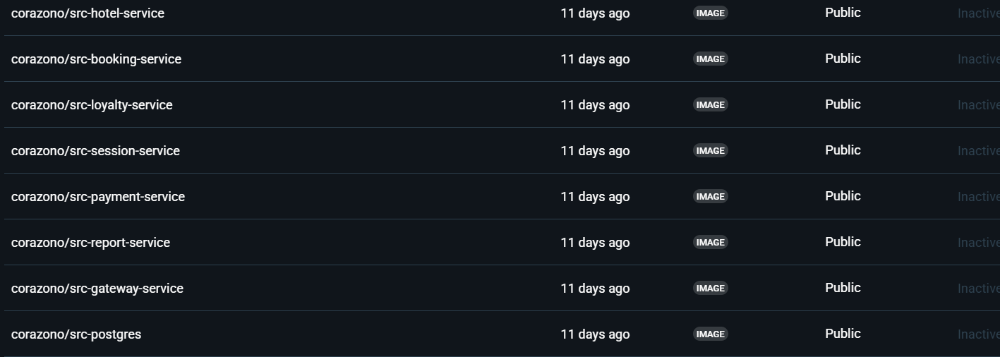

Поднимием виртуальные машины через vagrant compose up. Запускаем стек сервисов, используя написанный docker-compose файл.

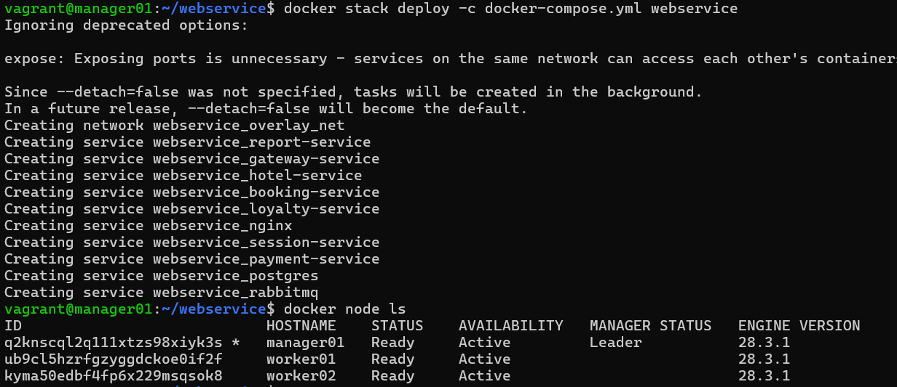

Настраиваем прокси на базе nginx для доступа к gateway service и session service по оверлейной сети. Сами gateway service и session service делаем недоступными напрямую.

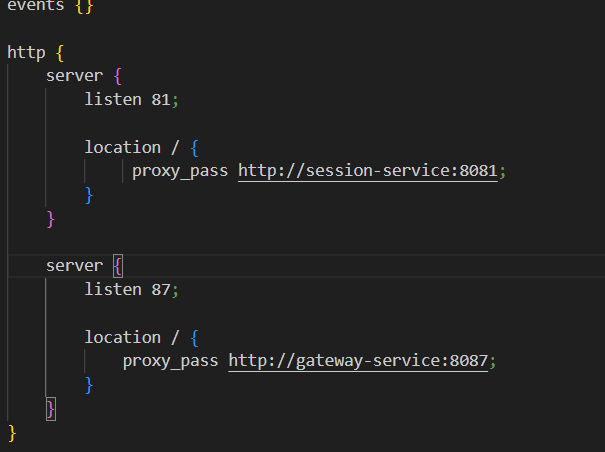

Прогоняем заготовленные тесты через postman 

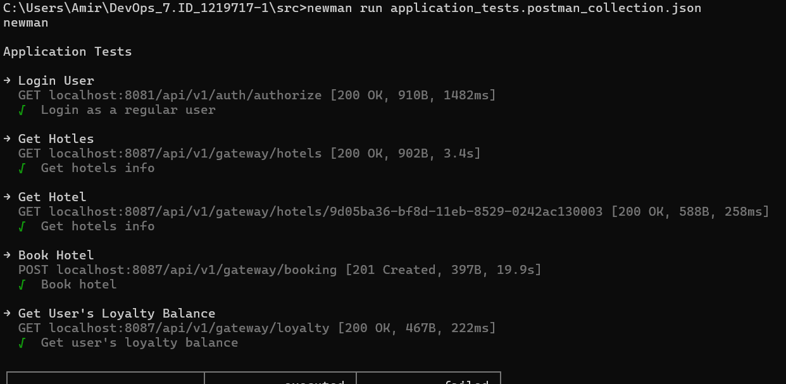

Используя команды docker, отображаем в отчете распределение контейнеров по узлам.

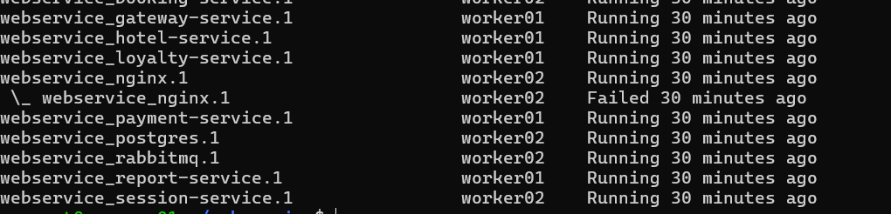

Установливаем отдельным стеком Portainer внутри кластера.

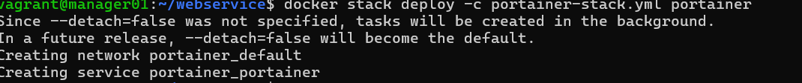

Отображаем визуализацию распределения задач по узлам с помощью Portainer.

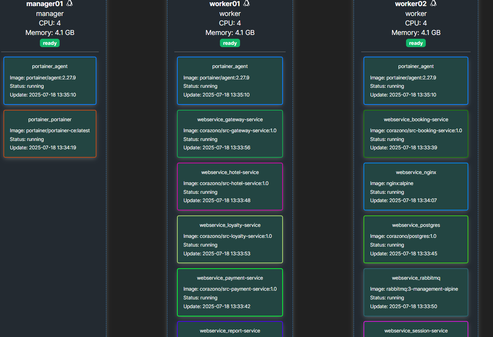