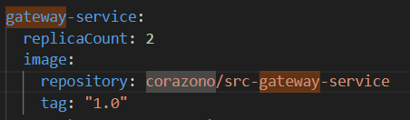

# Helm и Kustomization

## Part 1. Развертывание приложения с помощью Kustomize

1. Получием набор виртуальных машин с развернутым кластером через vagrant. Для автоматизации процесса создания кластера пишем bash-скрипт

2. Устанавливаем Kustomize

3. Cоздаем скелет проекта развертывания с одной базовой конфигурацией (base) и одной оверлейной конфигурацией (production).
в Base хранится база проекта из основных манифестов Deployment и Service: 

- Пишем Kustomization.yml Для базовой конфигурации, с Resources которые будут включены в базовую конфигурацию проекта

- Также пишем Kustomization.yml для оверлейной конфигурации, которая добавит к базовой конфигурации такие ресурсы как ConfigMap и Secrets, а также файл-патч, который изменяет существующий объект из base (изменит количество реплик для gateway service)

4. Собираем все манифесты и патчи через Kustomize через `sudo kubectl apply -k`

5. Смотрим что поды поднялись

5. Проверяем работоспособность приложения через тесты Postman

## Part 2. Развертывание приложения с помощью Helm

1. Получием набор виртуальных машин с развернутым кластером через vagrant. Для автоматизации процесса создания кластера пишем bash-скрипт

2. Переносим манифесты из предыдущих блоков.

3.  Устанавливаем Helm. 

4. Через команду `helm create` получаем шаблоны для своего приложения.

5.  Редактируем файл values.yaml для указания настроек конфигурации нашего приложения. Пример сервиса postgres:

Редактируем deployment template для нашего приложения

То же самое деалем с service template

6. Упаковываем helm-чарт с помощью команды `helm package` для создания файла *.tgz, содержащего чарт и его зависимости.

7. Развертываем helm-чарт в кластере Kubernetes с помощью команды `helm install`, задаем namespace helm-made и release name my-release

8. Проверяем статус подов через `kubectl get pods -n helm-made`

9. Вносим изменение в values.yaml (меняем кол-во реплик у gateway-service с 1 до 2), исполняем команду `helm upgrade` и видим что количество подов gateway service изменилось

10. Проводим тесты Postman и убеждаемся с работоспособности прилоежния

