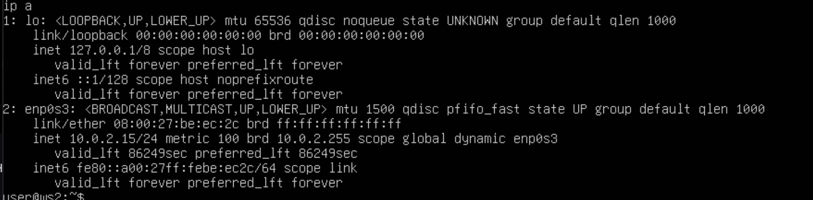
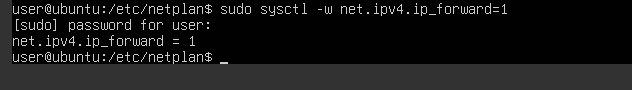

# Part 1. Инструмент ipcalc
## 1.1 Сети и маски

1) Адрес сети 192.167.38.54/13

2) Перевод маски 255.255.255.0 в префиксную и двоичную запись, /15 в обычную и двоичную, 11111111.11111111.11111111.11110000 в обычную и префиксную

3) Минимальный и максимальный хост в сети 12.167.38.4 при масках: /8, 11111111.11111111.00000000.00000000, 255.255.254.0 и /4

## 1.2 Localhost

Localhost - это локальная сеть, ее диапазон 127.0.0.0/8 т.е от 127.0.0.0 до 127.255.255.255.
Пропингуем данные адреса чтобы показать что адреса вне диапазона не смогут обратиться к localhost

Как мы видим к 127.0.0.2, 127.1.0.1 можно обратиться, а к 194.34.23.100, 128.0.0.1 нельзя

## 1.3 Диапазона и сегменты сетей

Для начала определимся с диапозом частных сетей:
10.0.0.1 – 10.255.255.255 (класс A) Крупные сети для больших корпораций или провйдеров
172.16.0.0 – 172.31.255.255 (класс B) Средние сети, например для университетов или компаний
192.168.0.0 – 192.168.255.255 (класс C) Маленькие сети обычно LAN

Следовательно:
10.0.0.45 частная
134.43.0.2 публичная
192.168.4.2 частная
172.20.250.4 частная
172.0.2.1 публичная
192.172.0.1 публичная
172.68.0.2 публичная
172.16.255.255 частная
10.10.10.10 частная
192.169.168.1 публичная

Диапазон адреса 10.10.0.0/18 является 10.10.0.1 - 10.10.63.254
следовательно
 10.0.0.1 не возможен
 10.10.0.2 возможен
 10.10.10.10 возможен
 10.10.100.1 не возможен
 10.10.1.255 возможен

# Part 2. Статическая маршрутизация между двумя машинами

Поднимаю две виртуальные машины

С помощью команы ip a смотрю существующие сетевые интерфейсы

Описать сетевой интерфейс, соответствующий внутренней сети, на обеих машинах и задать следующие адреса и маски: ws1 - 192.168.100.10, маска /16, ws2 - 172.24.116.8, маска /12

меняю netplan

## 2.1 Добавление статического маршрута вручную
Добавь статический маршрут от одной машины до другой и обратно при помощи команды вида ip r add. И пингую соеденинение между машинами.

## 2.2. Добавление статического маршрута с сохранением

Добавляю статический маршрут от одной машины до другой с помощью файла /etc/netplan/00-installer-config.yaml.

Пингую соеденинение между машинами

# Part 3. Утилита iperf3

## 3.1. Скорость соединения
Перевести и записать в отчёт:

8 Mbps = 1 MB/s(мегабит/c в мегабайт/c)

100 MB/s = 819200 Kbps(мегабайт/c в килобит/c)

1 Gbps = 1024 Mbps(гигабит/c в мегабит/c)

## 3.2. Утилита iperf3
Измеряем скорость соединения между ws1 и ws2

# Part 4. Сетевой экран

##4.1. Утилита iptables

Создаем файл /etc/firewall.sh
Содержимое файла /etc/firewall.sh на WS1 и WS2. Разница заключается в порядке команд, утилита iptables выполняет первое прочитанное правило, соответсвенно на WS1 будет выполнятся запрет и пинг не пройдет, а на WS2 наоборот, первым стоит ACCEPT, разрешить прохождение пакета, пинг пройдет

Запуск файлов на обеих машинах командами chmod +x /etc/firewall.sh и /etc/firewall.sh.

##4.2. Утилита nmap

Командой ping находим машину, которая не «пингуется», после чего утилитой nmap показываем, что хост машины запущен.

Сохраняем дампы

# Part 5. Статическая маршрутизация сети

Поднимаем пять виртуальных машин (3 рабочие станции (ws11, ws21, ws22) и 2 роутера (r1, r2)).

## 5.1 Настройка адресов машин
Настройка конфигурации машин в etc/netplan/00-installer-config.yaml согласно сети на рисунке.

Проверяем адреса через ip -4 a

Пингуем ws22 с ws21

Пингуем r1 с ws11

## 5.2 Включение переадресации IP-адресов
sysctl -w net.ipv4.ip_forward=1

Включение на постоянной основе

## 5.3 Установка маршрута по умолчанию

Скрины etc/netplan/00-installer-config.yaml:

Скрин выполнения команды ip r

Пингование r2 с ws11

## 5.4 Добавление статических маршрутов

обновляем netplan роутеров

смотрим маршруты роутеров через ip r

ip r list 10.10.0.0/[маска сети] и ip r list 0.0.0.0/0

Маршрут 10.10.0.0/18 был выбран так как маршрут с самой длинной маской подсети (то есть с наибольшим количеством совпадающих бит) считается наиболее конкретным и предпочтительным.

Запуск на r1 перехват сетевого трафика, проходящего через eth0 и пингование несуществующего IP с ws11

# Part 6. Динамическая настройка IP с помощью DHCP

Для r2 настраиваем в файле /etc/dhcp/dhcpd/conf конфигурацию службы dhcp

2) В файле resolv.conf прописываем 8.8.8.8

Перезагрузим службу DHCP

$ systemctl restart isc-dhcp-server

Настроим конфигурацию cети 00-installer-config.yaml на машине ws11. Добавим строки: macaddress: 

Аналогично r2 настроим r1 (с привязкой к MAC адресу ws11).

Перезагрузим службу DHCP

$ systemctl restart isc-dhcp-server

Перезагрузим ws11 через reboot и проверим, что она получила адрес. Также пропингуем ws11 с ws21.

Запросим с ws21 обновление ip адреса. Ip адрес до:

$ sudo dhclient enp0s8

# Part 7. NAT

В файле /etc/apache2/ports.conf на ws22 и r1 изменили строку Listen 80 на Listen 0.0.0.0:80, то есть сделали сервер Apache2 общедоступным

Запуск серверов Apache2

Добавить на r2 фаервол (/etc/firewall.sh). Прописать следующие правила:

Удаление правил в таблице filter - iptables -F;
Удаление правил в таблице "NAT" - iptables -F -t nat;
Отбрасывать все маршрутизируемые пакеты - iptables --policy FORWARD DROP;

Пинг с ws22 до r1 не удаётся

Добавить в фаервол ещё одно правило iptables -A FORWARD -p icmp -j ACCEPT и запустим фаервол.

Теперь машины должны пинговаться.

Включить DNAT на 8080 порт машины r2 и добавить к веб-серверу Apache, запущенному на ws22, доступ извне сети.

t - указывает на используемую таблицу;
p - указывает протокол (tcp, udp, udplite);
s - указывает адрес источника пакета;
d - указывает адрес назначения пакета;
i - задает входящий сетевой интерфейс;
o - указывает исходящий сетевой интерфейс.

Проверим соединение по TCP для SNAT, для этого с ws22 подключимся к серверу Apache на r1 командой telnet [адрес] [порт]:

Также проверим соединение по TCP для DNAT, для этого с r1 подключимся к серверу Apache на ws22 командой telnet (нужно обращаться по адресу r2 и порту 8080):
