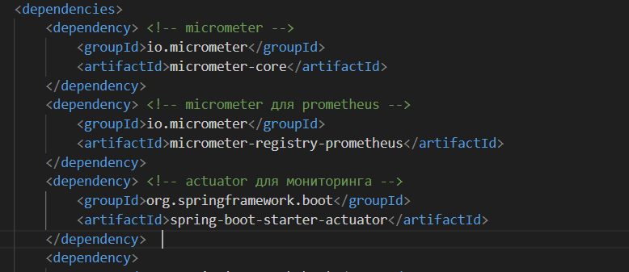
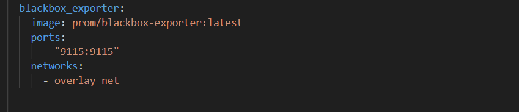
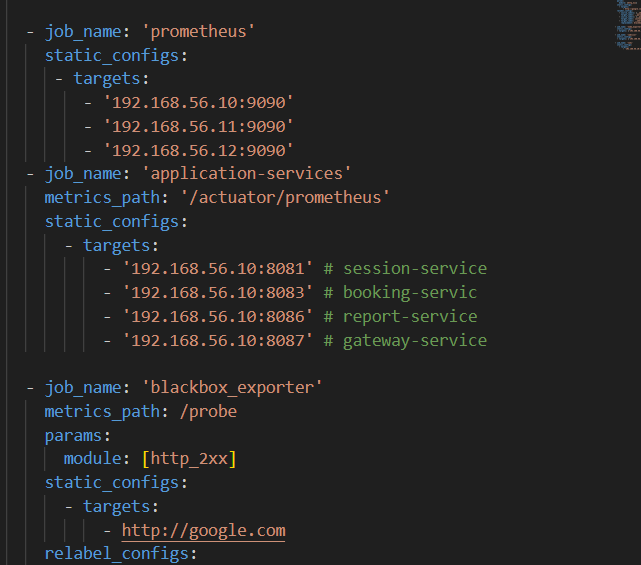

# Part 1. Получение метрик и логов

1. Используем Docker Swarm из первого проекта.

2. Пишем при помощи библиотеки Micrometer сборщики следующих метрик приложения

Для этого добавляем в pom.xml каждого сервиса следующие зависимости 

Также в application.properties добавляем эндпоинты для сбора метрик

Cобираем следующие метрики приложения

Количество отправленных сообщений в rabbitmq

Kоличество обработанных сообщений в rabbitmq

Kоличество бронирований

Kоличество полученных запросов на gateway

Kоличество полученных запросов на авторизацию пользователей

3. Добавляем логи приложения с помощью Loki.

Для этого создаем образ Loki

Создаем образ Promtail и пишем конфиг который будет собирать логи для контейнера и отправлять их Loki

/var/lib/docker/containers:/var/lib/docker/containers:ro
Пробрасывает папки с логами Docker контейнеров. Promtail читает .log файлы контейнеров

/var/run/docker.sock:/var/run/docker.sock
 Позволяет Promtail опрашивать Docker API, чтобы автоматически узнавать новые контейнеры и их метки ( имя, ID контейнера)

 

 Promtail читает логи Docker-контейнер и добавляет к ним метки (service, container, job) и отправляет в Loki.

 Также добавляем в стек Prometheus Server,  node_exporter, blackbox_exporter, cAdvisor. 

 

 

 

 

 В файле конфигируация Prometheus пишем Job'ы для сбора метрик с каждого источника

 

 

 Проверяем доступность метрик по порту 9090

 

# Part 2. Визуализация

Разворачиваем Grafana как новый сервис в стеке

Создаем следующие дашборды:
- количество нод;
- количество контейнеров;
- количество стеков;
- использование CPU по сервисам;
- использование CPU по ядрам и узлам;
- затраченная RAM;
- доступная и занятая память;
- количество CPU;
- доступность google.com;
- количество отправленных сообщений в rabbitmq;
- количество обработанных сообщений в rabbitmq;
- количество бронирований;
- количество полученных запросов на gateway;
- количество полученных запросов на авторизацию пользователей;
- логи приложения.

# Part 3. Отслеживание критических событий

1. Развертываем Alert Manager как новый сервис в стеке

Пишем правила для отслеживания следующих критических событий 
- доступная память меньше 100 Мб;
- затраченная RAM больше 1 Гб;
- использование CPU по сервису превышает 10%

Добавляем их в конфиг Prometheus, чтобы он отправлял уведомления на alert manager

Создаем бота в телеграм через Bot Father и получаем токен бота

Через api телеграма получаем Chat ID

Пишем конфиг для Alert Manager 

Провеярем что сообщения доходят

