# Part 1. Готовый Docker
Загружаем образ nginx через docker pull
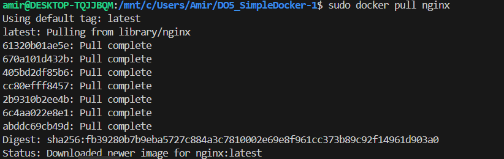

Проверяем наличие образа через docker images
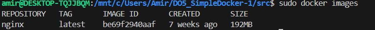

Запускаем контейнер через docker run
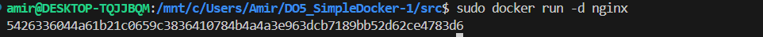

Проверяем что докер работает
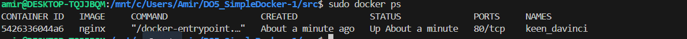

Смотрим информацию о Docker через inspect

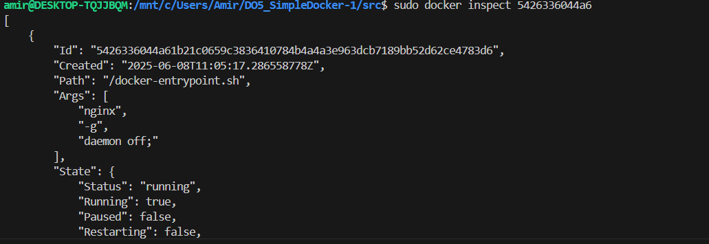

Размер докеры (shmSize) 
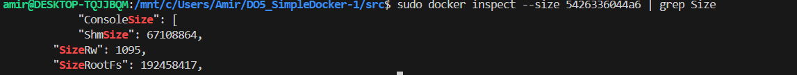

Заспамленные порты 
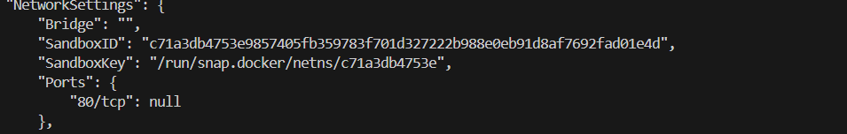

IP adress контейнеры
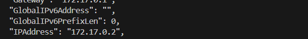

Остановливаем докер контейнер через docker stop и проверяем что он прекратил работу 
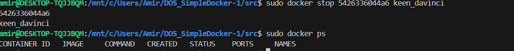

Запускаем докер с портами 80 и 443 в контейнере, замапленными на такие же порты на локальной машине, через команду run.
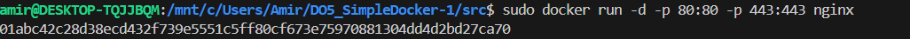

Провеяем, что в браузере по адресу localhost:80 доступна стартовая страница nginx.

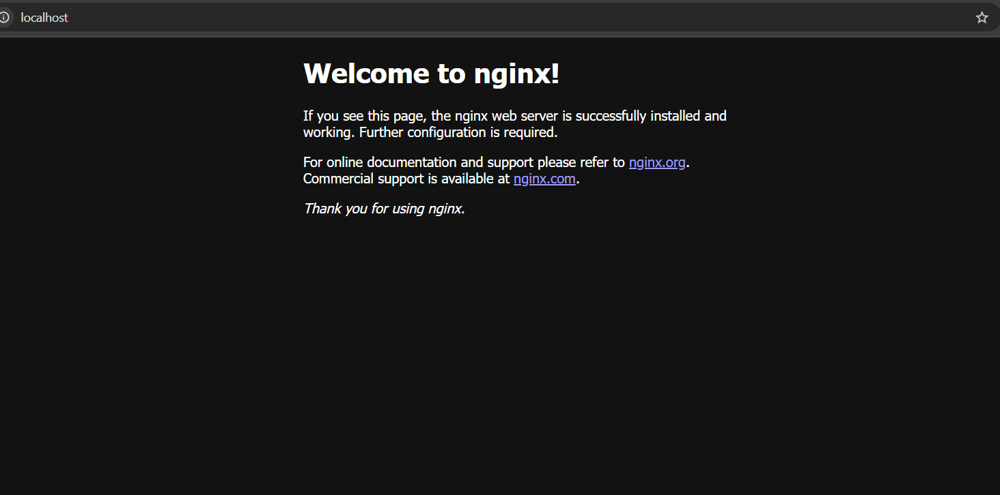

Перезапуск докера

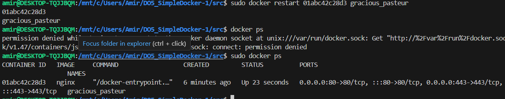

# Part 2. Операции с контейнером 

Читаем конфигурационный файл nginx.conf внутри докер контейнера через команду exec.
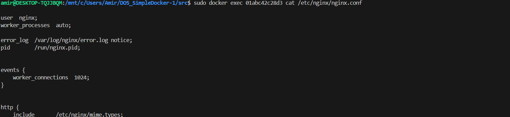

Создаем свой nginx.conf 
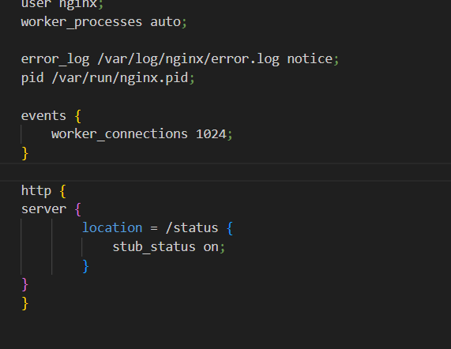

Копируем созданный файл nginx.conf внутрь докер-образа через команду docker cp.
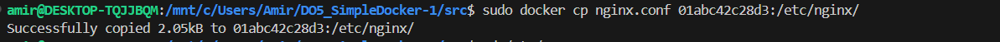

Провеяем, что по адресу localhost:80/status отдается страничка со статусом сервера nginx.

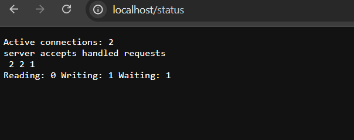

Экспортируем контейнер в файл container.tar через команду export.
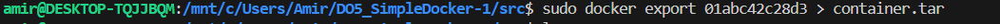

Останавливаем и удаляем докер
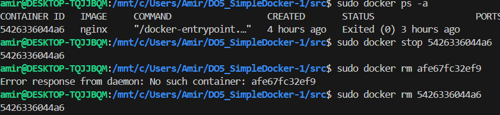

Импортируем контейнер обратно через import
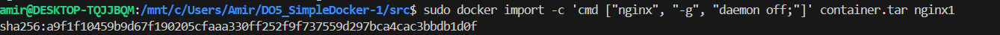

Запускаем контейнер 
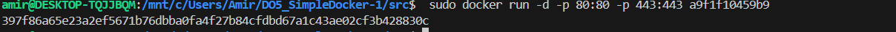

Проверяем, что по адресу localhost:80/status отдается страничка со статусом сервера nginx.

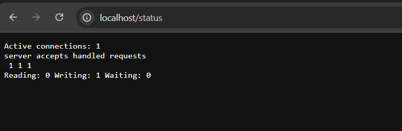

# Part 3. Мини веб-сервер

Пишем мини-сервер на C и FastCgi, который будет возвращать простейшую страничку с надписью Hello, World!. (см ./part3)

Запускаем написанный мини-сервер через spawn-fcgi на порту 8080.

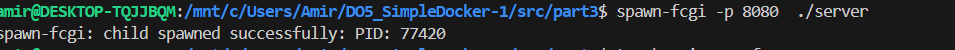

Пишем свой nginx.conf, который будет проксировать все запросы с 81 порта на 127.0.0.1:8080

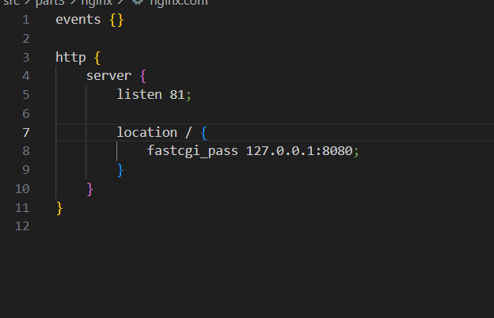

Запуск локально nginx с написанной конфигурацией.

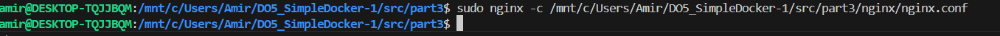

Проверяем что в браузере по localhost:81 отдается написанная тобой страничка.

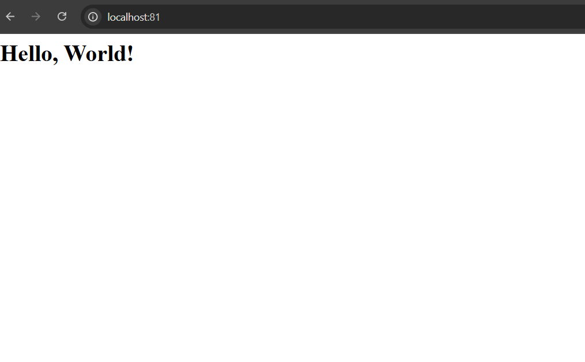

# Part 4. Свой докер

Пишем Dockerfile для создания своего докер-образа

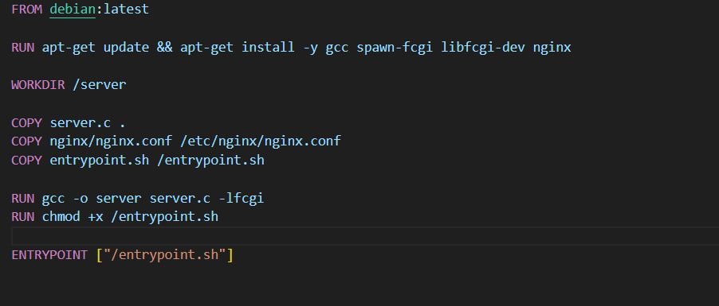

Собераем написанный докер-образ через docker build при этом указав имя и тег.

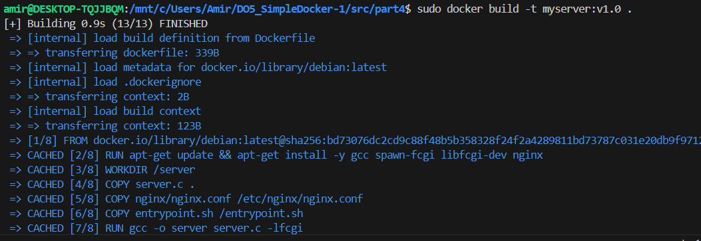

Запускаем собранный докер-образ с маппингом 81 порта на 80 на локальной машине и маппингом папки ./nginx внутрь контейнера по адресу, где лежат конфигурационные файлы nginx'а

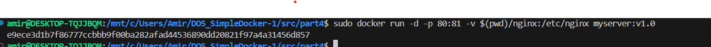

Проверяем что по localhost:80 выводится страница мини сервера

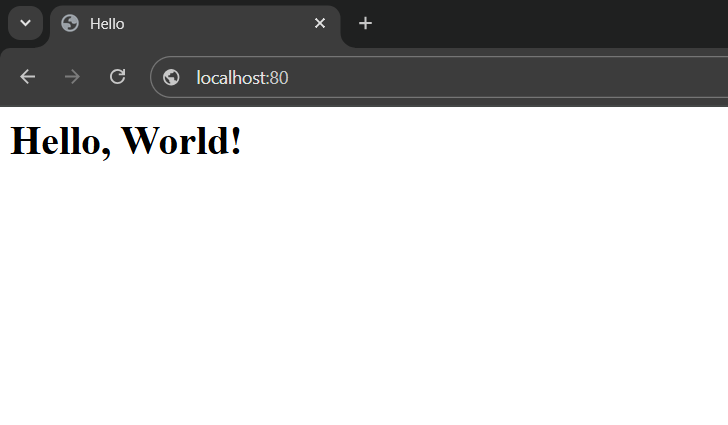

Добавляем ./nginx/nginx.conf проксирование странички /status, по которой надо отдавать статус сервера nginx.

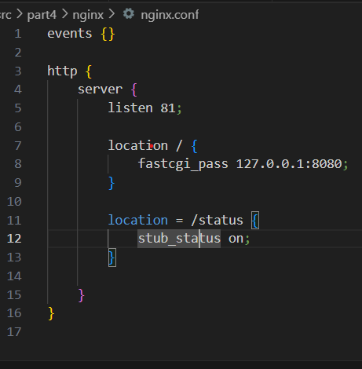

Пересобираем и запускаем образ заново 
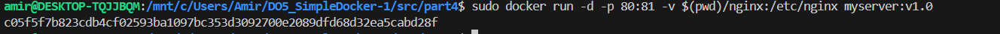

Проверяем что теперь по localhost:80/status отдается страничка со статусом nginx

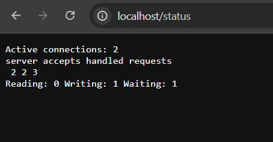

# Part 5. Dockle

 Сканируем образ из предыдущего задания через Dockle на предмет ошибок

 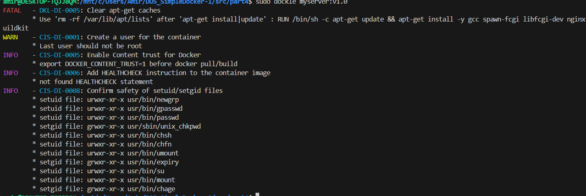

 Как видим можно заметить ряд ошибок и предупрждений

 ## FATAL   - DKL-DI-0005: Clear apt-get caches 
 Данная ошибка говорит о том, что не очищается кэш после установки пакетов (apt-get update && apt-get install), что увеличивает размер Docker образа

 ## WARN — CIS-DI-0001: Create a user for the container
 Данное предупреждение подразумевает отсутсвия создания юзера, из-за чего все в данном контейнере будет выполняться от имени root, что является плохой практикой с точки зрения безопасности

 ## INFO - CIS-DI-0006: Add HEALTHCHECK instruction to the container image
 Данная рекомендация означает что нет проверки на работу контейнера внутри, инструкция HEALTHCHECK говорит Docker, как проверять, "здоров" ли контейнер внутри. Это полезно для автоматического мониторинга и перезапуска контейнеров в случае ошибок.

## INFO    - CIS-DI-0008: Confirm safety of setuid/setgid files
Данная рекомендация сообщает о наличие файлов с рут правами для всех юзеров. В нашем контейнере мы запускаем всё не от root, а от обычного пользователя user. Это значит, что даже если есть программы с setuid, которые обычно дают повышенные права, внутри контейнера они не смогут навредить, потому что у этого пользователя нет прав администратора. Поэтому риск использовать эти программы для взлома очень низкий. Однако, если таких файлов с setuid слишком много, большой шанс уязвимости в них с помощью которых злоумышленник может получить root права на весь контейнер

## INFO - CIS-DI-0005: Enable Content trust for Docker
Рекомендация говорит: включите Content Trust, чтобы Docker проверял подписи образов и не запускал потенциально опасные контейнеры.
В нашем случае можно проигнорировать данную рекомендацию так как мы используем собственный образ, а не экспортируем его извне

Исправляем ошибки (см Dockerfile) и проверяем еще раз через Dockle
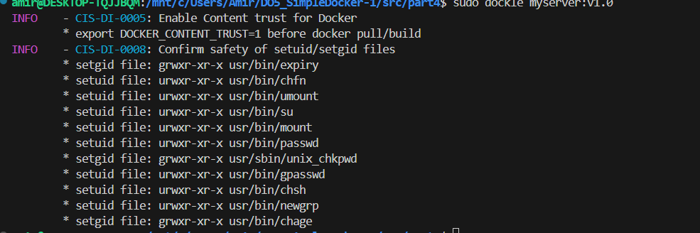

# Part 6. Базовый Docker Compose

Пишем docker compose файл с помощью которого поднимаем контейнер из Part 5, и новый контейнер с nginx  который будет проксировать все запросы с 8080 порта на 81 порт первого контейнера.   

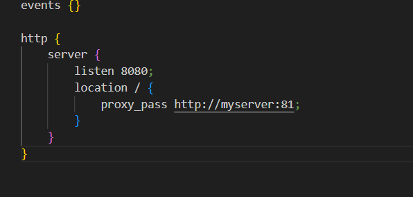

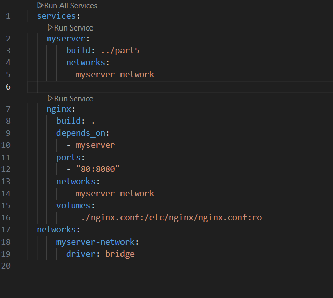

Останавливаем все прежде запущенные контейнеры

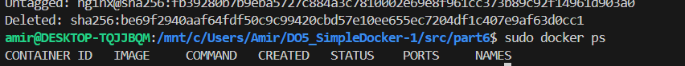

Билдим и запускаем проект

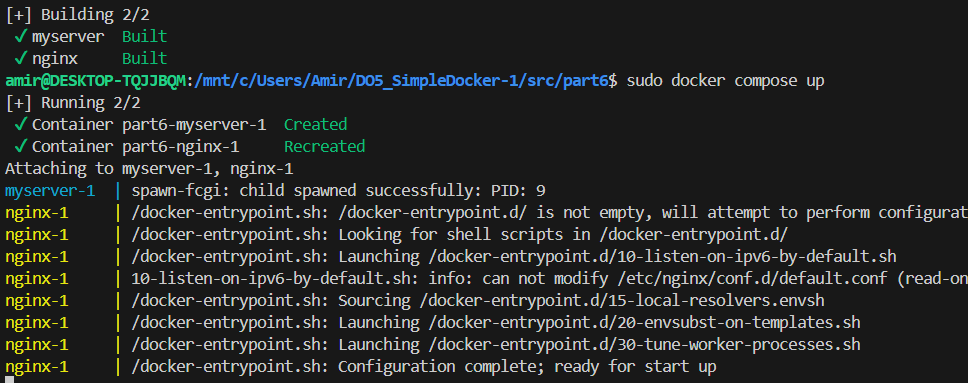

Проверяем что в браузере отдается страница

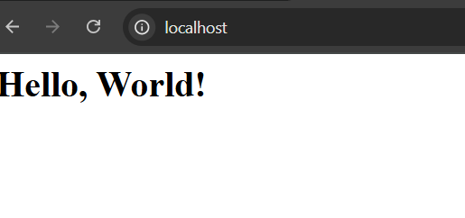